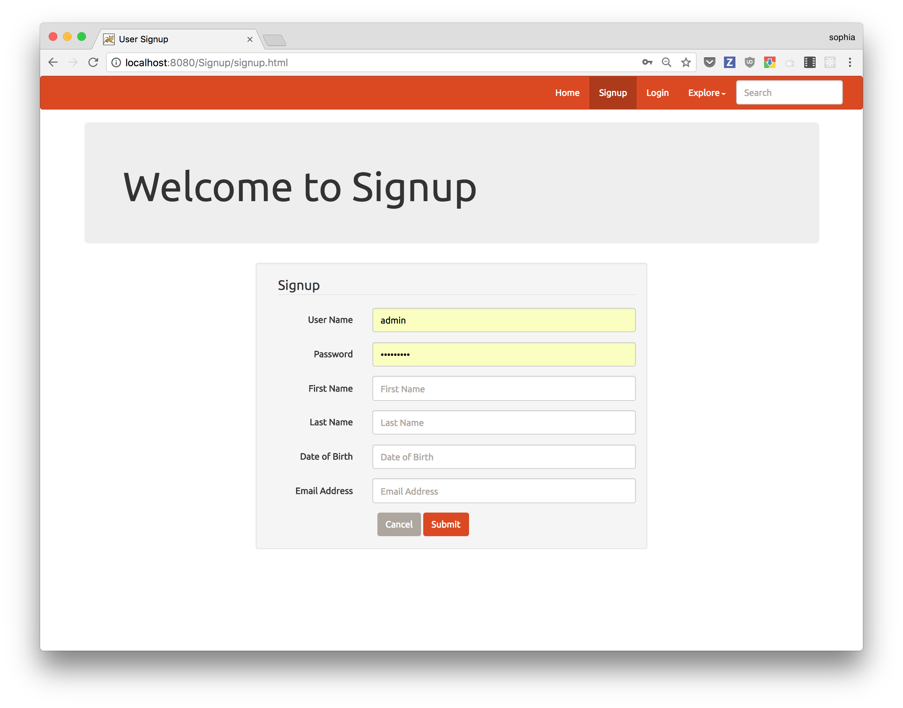
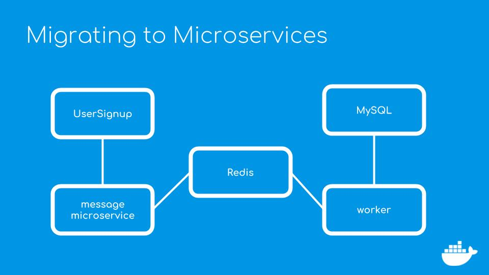
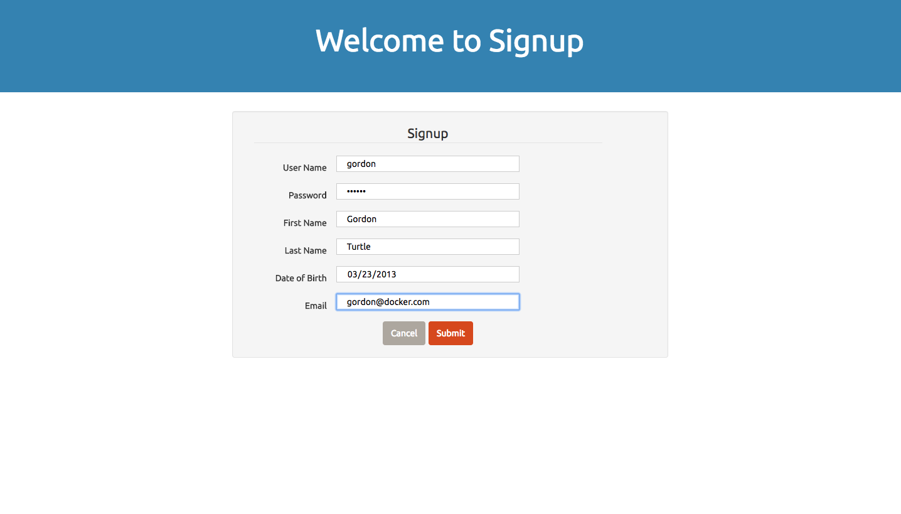

# Modernizing Traditional Applications for Java Developers

This example demonstrates the process for migrating a n-tier Java application to a container based architecture using Docker.

This process follows these steps to migrate to a containers

* Containerize the existing code in place and operation to rollback if needed.
* Develop locally applications.
* Deploy the new services Docker.
* Add extra services to add value to the application.
* Test the code.

The repository follows the video series which is presented in 5 parts.

## Containerizing Application (Part 2)

As a first step, containerizing the application without changing existing code let's us test the concept of migrating the application to a container architecture. I'll do this by building the application from the source code and deploying it in an application server.  The code for containerizing the application can be found in the [part_2](./part_2) directory. Additionally, I'll configure and deploy the database.

Docker makes this possible with a Dockerfile, which is a text document that contains all the commands a user could call on the command line to assemble an image. Using docker build users can create an automated build that executes several command-line instructions in succession.

Within a Dockerfile, I'll perform a multi-stage where the code will be compiled and packaged using a container running maven.  All dependencies and jar files are downloaded to the maven container based on the pom.xml file. The toolchain to build the application is completely in the maven container and not local to your development environment. All builds will be exactly the same regardless of the development environment.

```
FROM maven:latest AS devenv
WORKDIR /usr/src/signup 
COPY app/pom.xml .
RUN mvn -B -f pom.xml -s /usr/share/maven/ref/settings-docker.xml dependency:resolve
COPY ./app .
RUN mvn -B -s /usr/share/maven/ref/settings-docker.xml package -DskipTests
```

The second part of the multi-stage build deploys the application in a Java application server. I'm using Tomcat in this tutorial but the process is the same for any other application service. This part of the build configures Tomcat by adding custom configuration files, copying needed jars such as the MySQL JDBC connector, and the application packaged as a WAR file.

```
FROM tomcat:7-jre8
LABEL maintainer="Sophia Parafina <sophia.parafina@docker.com>"

# tomcat-users.xml sets up user accounts for the Tomcat manager GUI
ADD tomcat/tomcat-users.xml $CATALINA_HOME/conf/

# ADD tomcat/catalina.sh $CATALINA_HOME/bin/
ADD tomcat/run.sh $CATALINA_HOME/bin/run.sh
RUN chmod +x $CATALINA_HOME/bin/run.sh

# add MySQL JDBC driver jar
ADD tomcat/mysql-connector-java-5.1.36-bin.jar $CATALINA_HOME/lib/

# create mount point for volume with application
WORKDIR $CATALINA_HOME/webapps/
COPY --from=devenv /usr/src/signup/target/Signup.war .

# add tomcat jpda debugging environmental variables
#ENV JPDA_OPTS="-agentlib:jdwp=transport=dt_socket,address=8000,server=y,suspend=n"
ENV JPDA_ADDRESS="8000"
ENV JPDA_TRANSPORT="dt_socket"

# start tomcat7 with remote debugging
EXPOSE 8080
CMD ["run.sh"]
```

Building the database container follows a similar patter, including creating the database schema.

```
FROM mysql:latest

# Contents of /docker-entrypoint-initdb.d are run on mysqld startup
ADD  docker-entrypoint-initdb.d/ /docker-entrypoint-initdb.d/

# Default values for passwords and database name. Can be overridden on docker run
ENV MYSQL_DATABASE=signup
ENV MYSQL_USER=gordon
ENV MYSQL_PASSWORD=password
```

### Building and running the application
I can build the containers individually, 

```
$ cd ./appserver
$ docker image build -t registration .
$ cd ./database
$ docker image build -t registrationdb .
```

and run it from the command line:

```
$ docker container run -d -p 3306:3306 --name registrationdb --network signupnet registrationdb
$ docker container run -d -p 8080:8080 --name registration --network signupnet registration
```
Browse to `http://localhost:8080/Signup` and you'll see the application.

###  Automating build and deploy

Docker lets me automate the process of building and running the application using a single file using Docker Compse. Compose is a tool for defining and running multi-container Docker applications. With Compose, you use a YAML file to configure your application’s services. Then, with a single command, you create and start all the services from your configuration.

I'll go through the Compose [file](./part_2/docker-compose.yml) 
```
version: "3.3"

services:

  database:
    build:
      context: ./database
    image: registrationdb
    # set default mysql root password, change as needed
    environment:
      MYSQL_ROOT_PASSWORD: password
    # Expose port 3306 to host. Not for the application but
    # handy to inspect the database from the host machine.
    ports:
      - "3306:3306" 
    networks:
      - back-tier
```
In the section above, I build the database container based on the Dockerfile in the `./database` directory which is also the Docker context or root directory for building the image. I can pass environmental variables such as the password and the port. I also name the image using the `image:` directive. 
```
  webserver:
    build: 
      context: ./appserver
    image: registration
    ports:
      - "8080:8080" 
      - "8000:8000"
    networks:
      - front-tier
      - back-tier
```
In this section, I build the application in the `./appserver` directory and name the image `registration`. As in the database, I set the external ports.
```
networks:
  back-tier:
  front-tier
```

In this section, I've defined two networks, the back-tier network isolates backend components from components on the front-tier network. This seems unnecessary in this current configuration but I'll make use of the networks in later iterations.

To run the application for the first time and build the images, use the docker-compose command

```
$ docker-compose up --build
```
Browse to [http://localhost:8080/Signup](http://localhost:8080/Signup) to try out the application.




## Adding Services (Part 3)

The original application is running in containers. The application is now reproducible and portable. If I have to a a change, such as updating the application server or Java version, I can simply replace the base image in the Dockerfile and build a new image. I can roll back to the previous images if necessary.

Now that I have stable build process, I can start migrating from a N-tier architecture to a service oriented architecture. I'll do this by picking a key feature that can broken off into a service.

One of the problems associated with Java CRUD (create, read, update, delete) clients is that database operations can be expensive in terms of fetching and reading data from I/O and memory. Lots of users trying to write to a synchronous database can cause a bottleneck. One pattern to ameliorate the cost is to use a message queue. For this feature, I can publish an event from the Web app to a message queue and move the data-persistence code into a new component that handles that event message. This design does scale, if I have a spike of traffic to the Web site I can run more containers on more hosts to cope with the incoming requests. Event messages will be held in the queue until the message handler consumes them.

I’ll get around the bottleneck by adding a RESTful microservice that writes the user data to a Redis that stores the information in a queue. If you’re not familiar with Redis. It’s an in memory key-value store that’s great for saving abstract data types such as JSON lists. Note that I could use any other key-value datastore in place of Redis, such as memcached or MongoDB.

I’ll write the [messageservice](./part_3/messageservice) in Spring Boot.  The reason I choose Spring Boot because it has many advantages such as handling the database connections transparently, it simplifies implementing both a MVC architecture and RESTful interfaces, and includes a built-in application server in the form of Tomcat. Another factor in choosing Spring Boot is that it has good support for Redis.  I could have chosen to use Spring as in the original application, but all of these advantages simplifies configuration and deployment. 

The message service is an MVC application that uses the same User entity model in the orginal application. It consists of a repository for interacting with  Redis, a service that handles the connection and transport, and a controller for the REST endpoint. 

The next piece is a [worker microservice](./part_3/worker) that retrieves the user data stored in Redis and writes the data to the application’s MySQL database. The worker is a Plain Old Java Object or POJO that pulls the data from Redis using the blpop method. This method allows the worker to to pop data from the queue without constantly checking the status of the queue. Blpop works like a one time trigger that fires when data gets placed in the queue. Setting up the communication between the application and the worker establishes a reliable and fast queuing system.

I’ll be adding three new components to the application - a Redis instance, the messageservice and the worker that writes to the database. Adding all these new elements adds complexity to deployment and maintenance when compared to a monolithic application comprised of only a application server and a database. But I’ll use Docker to easily deploy, manage and maintain all these additional services.



I've written Dockerfiles for both the [messageservice](./part_3/messageservice/Dockerfile) and the [worker](./part_3/worker/Dockerfile) to build them as images. Since Spring Boot includes Tomcat and the worker is just a jar file, I can build and deploy both components in a Java container. A Dockerfile is not needed for Redis because I'll use official Redis image without any additional configuration.

As in the previous example, I'll use a Compose file to build and deploy all the application components.

```
  messageservice:
    build:
      context: ./messageservice
    image: messageservice
    ports:
      - "8090:8090"
    networks: 
      - back-tier

  worker:
    build:
      context: ./worker
    image: worker
    networks: 
      - back-tier

  redis:
    image: redis
    container_name: redis
    ports: 
      - "6379:6379"
    networks:
      - back-tier
```
One last thing, I'll need to modify the code in the original application to send the user data from the form to messageservice instead of writing it to the database directly.

```
	@RequestMapping(value="/signup", method=RequestMethod.POST)
	public String signup(@Valid @ModelAttribute("user") User user, BindingResult result, Model model) {		
		if(result.hasErrors()) {
			return "signup";
		} else if(userService.findByUserName(user.getUserName())) {
			model.addAttribute("message", "User Name exists. Try another user name");
			return "signup";
		} else {
			String uri = new String("http://messageservice:8090/user");
			RestTemplate rt = new RestTemplate();
			Long id = new Long(new Random().nextInt(10000)+10000);
			user.setId(id);
			try {
				rt.postForObject(uri, user, String.class);
			} catch(Exception e) {
				System.out.println(e);
			}
			model.addAttribute("message", "Saved user details");	

			return "redirect:login.html";
		}
	}
```
The main change in the code is that the data is posted to the messageserice. Note the URL, it uses the name of the messageservice defined in the Compose file. Ideally, the URL of the service would be an environmental variable set in the Compose file, but I hardcoded it to be explicit in this example. 

Since, there are existing containers with the same name, I'll force a completely new build.
```
$ docker-compose build --force-rm --no-cache --pull
```

To run the application:
```
$ docker-compose up
```
Browse to the application, if you fill out the form there won't be a noticeable change but you'll see logging output similar to this in the terminal:

        worker            | # HTTP/1.1 201 Created
        worker            | # Location: /signup/user/12425
        worker            | # content-type: application/json; charset=UTF-8
        worker            | # content-length: 158
        worker            | #
        worker            | # {"_index":"signup","_type":"user","_id":"12425","_version":1,"result":"created","_shards":{"total":2,"successful":1,"failed":0},"_seq_no":0,"_primary_term":1}
        worker            | Feb 08, 2018 1:55:18 AM org.apache.http.impl.nio.client.InternalIODispatch inputReady
        worker            | FINE: http-outgoing-0 [ACTIVE] [content length: 158; pos: 158; completed: true]
        webserver         | Feb 08, 2018 1:55:28 AM org.apache.jasper.compiler.TldLocationsCache tldScanJar
        webserver         | INFO: At least one JAR was scanned for TLDs yet contained no TLDs. Enable debug logging for this logger for a complete list of JARs that were scanned but no TLDs were found in them. Skipping unneeded JARs during scanning can improve startup time and JSP compilation time.
        webserver         | Hibernate:
        webserver         |     select
        webserver         |         user0_.id as id0_,
        webserver         |         user0_.dateOfBirth as dateOfBi2_0_,
        webserver         |         user0_.emailAddress as emailAdd3_0_,
        webserver         |         user0_.firstName as firstName0_,
        webserver         |         user0_.lastName as lastName0_,
        webserver         |         user0_.password as password0_,
        webserver         |         user0_.userName as userName0_
        webserver         |     from
        webserver         |         user user0_
        webserver         |     where
        webserver         |         user0_.userName=?
        registrationdb    | 2018-02-08T03:46:55.043001Z 0 [Note] InnoDB: page_cleaner: 1000ms intended loop took 5966815ms. The settings might not be optimal. (flushed=0 and evicted=0, during the time.)
        redis             | 1:M 08 Feb 03:46:55.050 * 1 changes in 3600 seconds. Saving...
        redis             | 1:M 08 Feb 03:46:55.115 * Background saving started by pid 17
        redis             | 17:C 08 Feb 03:46:55.324 * DB saved on disk
        redis             | 17:C 08 Feb 03:46:55.328 * RDB: 0 MB of memory used by copy-on-write
        redis             | 1:M 08 Feb 03:46:55.331 * Background saving terminated with success
        elasticsearch     | [2018-02-08T03:57:21,388][INFO ][o.e.m.j.JvmGcMonitorService] [SZIxpFT] [gc][1398] overhead, spent [411ms] collecting in the last [1s]
        registrationdb    | 2018-02-08T12:50:36.027838Z 0 [Note] InnoDB: page_cleaner: 1000ms intended loop took 26111086ms. The settings might not be optimal. (flushed=0 and evicted=0, during the time.)
        registrationdb    | 2018-02-08T17:15:20.001749Z 0 [Note] InnoDB: page_cleaner: 1000ms intended loop took 2325445ms. The settings might not be optimal. (flushed=0 and evicted=0, during the time.)

The output shows the registration app writing the data to Redis and the worker pulling the data and writing it to MySQL.

## Adding Monitoring and Logging

One of the advantages of splitting out a feature into a separate service is that it makes it easier to add new features. In part 4, I'll take advantage of the new service to implement logging and monitoring.

I'll implement Elasticsearch and Kibana to collect and visualize data from the application. To gather the data for the reporting database in Elasticsearch, I’ve added code to the worker that listens to events published by the web application. The analytics worker receives the data and saves it in Elasticsearch which is running in Docker container. I’ve chosen Elasticsearch because it can be clustered across multiple containers for redundancy and it has Kibana, which is an excellent front-end for analytics.

I’m not making changes to the application or the registration microservice, so I can just add new services for Elasticsearch and Kibana in the Docker Compose file. One of the features of Docker is that Docker Compose can incrementally upgrade an application. 

```
#logging
  elasticsearch:
    image: docker.elastic.co/elasticsearch/elasticsearch-oss:6.1.2
    container_name: elasticsearch
    ports:
      - "9200:9200"
      - "9300:9300"
    environment:
      ES_JAVA_OPTS: "-Xmx256m -Xms256m"
    networks: 
      - elk

  kibana:
    image: docker.elastic.co/kibana/kibana-oss:6.1.2
    container_name: kibana
    ports:
      - "5601:5601"
    networks: 
      - elk
    depends_on:
      - elasticsearch
```

It won’t replace running containers if their definition matches the service in the Docker Compose file. Since the worker service has been updated docker-compose up -d will run the containers for the Elasticsearch, Kibana and the message handler. It will leave the other containers running as is,letting me add new features without taking the application offline.


To run the example:
```
$ docker-compose up -d
```

To make the example more visually interesting, I added code to calculate the age of the person based on their birthday and write that to Elasticsearch. To test it out, I wrote a small shell script that posts the user data to the service to populate the database.
```
$ ./firefly_data.sh
```
Now, I can use Kibana to index the data and look at the data.


I can then make a chart of the character's ages using a Kibana visualization.


## Iterating on the Client (Part 5)

Another benefit adding the messaging service is that it's now possible to update the client without having to rebuild the application. The original application used Java Server Pages for the client UI which is compiled along with the servlet. The message service let's me write another client in Javascript.

I'm using React.js along with Bootstrap to write the new client interface. React is a popular Javascript framework that has many built in features such as the calendar widget in the form fields. In addition, Bootstrap is a well known CSS library used for responsive web pages. One advantage is that updating the client no longer needs a Java developer and can be done by a front end developer. 

I built the client using Node.js and deployed it to Nginx using a multi-stage build using the same pattern that I used with the orginal application.

```
FROM node:latest AS build-deps
WORKDIR /usr/src/signup_client
COPY package.json yarn.lock ./
RUN yarn
COPY . ./
RUN yarn build

FROM nginx:alpine
COPY nginx.conf /etc/nginx/conf.d/default.conf
COPY --from=build-deps /usr/src/signup_client/build/ /usr/share/nginx/html
EXPOSE 80
CMD ["nginx", "-g", "daemon off;"]
```

I then added it to the Compose file and brought it up with the `docker-compose up -d` command.

```
  js_client:
    build:
      context: ./signup_client
    image: js_client
    container_name: js_client
    ports:
      - "80:80"
    networks: 
      - front-tier
```
I can sign up a new user with the client.


And login from the orginal client interface.


