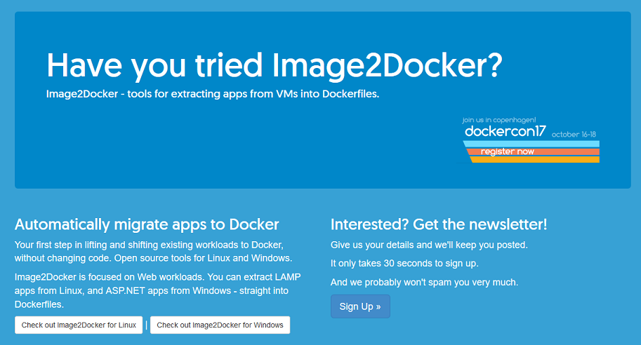
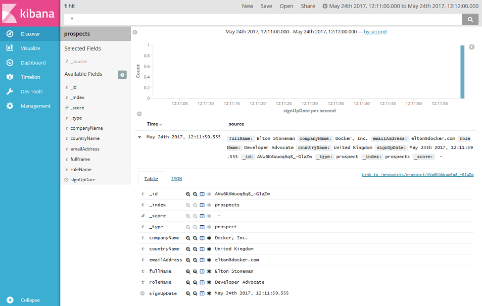

# Newsletter Sign Up

A .NET Framework app using Docker containers on Windows. The app lets users sign up to a fictional newsletter:



## Architecture

This is a distributed application, running across multiple containers (defined in [docker-compose.yml](app/docker-compose.yml)):

- `db` - [SQL Server Express](https://store.docker.com/images/mssql-server-windows-express), used to store prospect details
- `message-queue` - [NATS](https://store.docker.com/images/nats) message queue, used for event publishing and subscribing
- `web` - ASP.NET WebForms application, front end for prospects to sign up
- `save-handler` - .NET console app, listens for prospect events and saves data to `db`
- `index-handler` - .NET console app, listens for prospect events and saves data to `elasticsearch`
- `elasticsearch` - [Elasticsearch](https://cloud.docker.com/swarm/sixeyed/repository/docker/sixeyed/elasticsearch/general) document database, used for reporting
- `kibana` - [Kibana](https://cloud.docker.com/swarm/sixeyed/repository/docker/sixeyed/kibana/general) front end to `elasticsearch`, used for self-service analytics

## Pre-reqs

These are all Windows images, so you'll need Windows 10 or Windows Server 2016, and [Docker for Windows](https://store.docker.com/editions/community/docker-ce-desktop-windows) installed. 

> [Docker secrets](https://docs.docker.com/engine/swarm/secrets/) and [multi-stage builds](https://docs.docker.com/engine/userguide/eng-image/multistage-build/) are used too, so you'll need at least version `17.06` of Docker.


## Build - *Optional

All the images used in the sample are available in public image repositories on Docker Cloud. You don't need to build from source, but if you want to you can clone this repo, and from the root directory use Docker Compose to build the app:

```
docker-compose `
 -f .\app\docker-compose.yml `
 -f .\app\docker-compose.build.yml `
 build 
```

You'll see that Docker compiles the .NET apps before packaging them into images. That's the multi-stage build using an [image from Docker Cloud with MSBuild installed](https://cloud.docker.com/swarm/sixeyed/repository/docker/sixeyed/msbuild/general), so you don't need Visual Studio - or even .NET - installed on your machine to build this app from source code.

> The build images use [Windows Server Core](https://store.docker.com/images/windowsservercore), which is a large base image. The first time you run the build it will pull any missing images, which could take a while.

When the build completes, run the app - you can either run in swarm mode, or on a standalone Docker instance with Docker Compose.

## Running the App in Swarm Mode

The app is configured to use secrets in swarm mode, so the database credentials are securely stored and distributed by the swarm. The only place where the sensitive data can be read is inside the containers, and the application code reads that configuration from the secret files.

You can turn your laptop into a single-node swarm:

```
docker swarm init
```

And now you can create secrets. There's a [script in the repo](app/create-secrets.ps1) that does that for you, but it just creates secrets using the contents of text files:

```
cd app
.\create-secrets.ps1
```

The [docker-stack.yml](app/docker-stack.yml) file contains the whole application configuration, including the secrets for the web app, console app and database. You can deploy the whole distributed application as a stack:

```
docker stack deploy --compose-file docker-stack.yml signup
```

Docker will create all the services, and make the secrets available to the relevant containers. 

### Running the App with Compose

If you're not running Docker in swarm mode, you can still run the app with Docker Compose. You lose the secure secrets, but you still have the same functionality:

```
docker-compose `
 -f .\app\docker-compose.yml `
 -f .\app\docker-compose.local.yml up -d
```

> This approach uses unencrypted text files instead of secrets, so it's only suitable for dev environments. 

## Try the App

If you've deployed the app to a swarm, just browse to the IP address of the swarm host - the web application is mapped to port 80 on the host.

If you've deployed using compose, you'll need the IP address of the `web` container to open the site. In PowerShell, this grabs the IP address of the container and launches your browser:

```
$ip = docker inspect --format '{{ .NetworkSettings.Networks.nat.IPAddress }}' app_web_1
start "http://$ip"
```

The application functionality is the same however you run it, because the stack and the local compose deployment use the same images and the same [core compose file](app/docker-compose.yml).

Save your details and you can check the logs of the message handler services (or containers) to see the events being consumed and processed. You can connect to the SQL Server container from SSMS (using the IP address of the `db` container and the credentials in [db-credentials.env](app/db-credentials.env)), or run a command in the container to see the data:

```
docker exec app_db_1 `
 powershell "Invoke-SqlCmd -Query 'SELECT * FROM Prospects' -Database SignUp"
```

You can browse to Kibana too, to see how the data is saved in the reporting database:

```
$ip = docker inspect --format '{{ .NetworkSettings.Networks.nat.IPAddress }}' app_kibana_1
start "http://$($ip):5601"
```

The index is called `prospects`, and you'll see that the fields are pre-populated from Elasticsearch with the data you've added:




## Run End-to-End Tests

There's also an [integration test suite](src/SignUp/SignUp.EndToEndTests/ProspectSignUp.feature) in the source code, which uses [SpecFlow](http://specflow.org/), [Selenium](http://www.seleniumhq.org/) and [SimpleBrowser](https://github.com/SimpleBrowserDotNet/SimpleBrowser). Those tests run a headless web browser which connects to the site and completes the sign up form with a set of known data. Then for each case it checks the data exists in SQL Server.

Build the tests from the root path of the repo:

```
docker build -t dockersamples/signup-e2e-tests -f docker\e2e-tests\Dockerfile .
```

The output is an image which has [NUnit Console](https://github.com/nunit/docs/wiki/Console-Command-Line) installed, along with the compiled test suite. Running the test suite in a container means it can access the `web` and `db` app containers by name, using service discovery built into Docker.

Run the tests and you'll see all 26 pass:

```
docker run --env-file app\db-credentials.env --name e2e-tests dockersamples/signup-e2e-tests
...
Test Run Summary
  Overall result: Passed
  Test Count: 26, Passed: 26, Failed: 0, Warnings: 0, Inconclusive: 0, Skipped: 0
  Start time: 2017-05-24 12:34:00Z
    End time: 2017-05-24 12:34:07Z
    Duration: 7.349 seconds

Results (nunit3) saved as TestResult.xml
```
